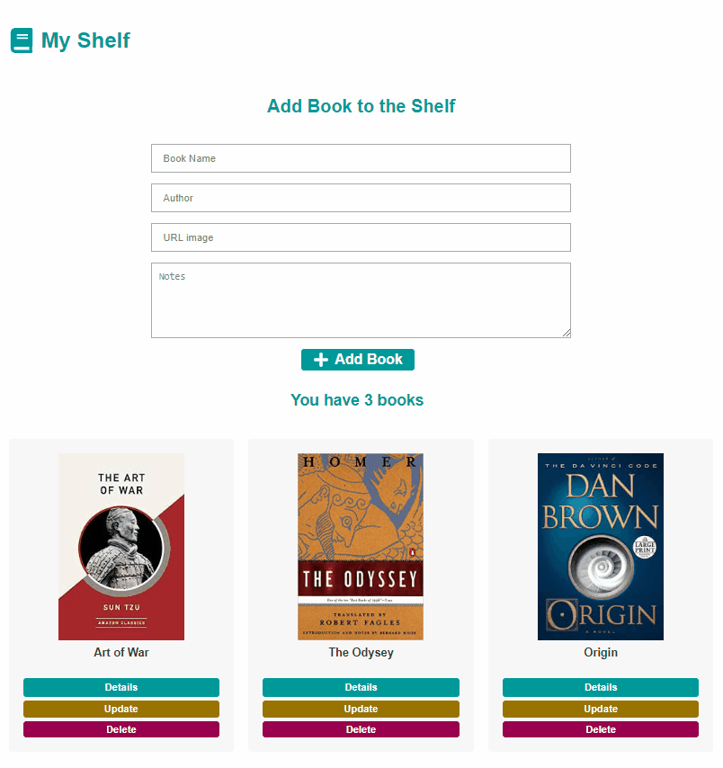

# My Shelf

This project is build for those who always wanted a place to store the collection of books they have already read, and who always wanted to re-read some of the most remarkable quotes in an easy and quick way, getting only the most important quotes, underlines and annotations from these books.
Here you can input all the book informations, select an url image for the book, and the most important, you can edit and review your notes easily. 

## Demo

## Technologies Used
  
  ### Back End
  
  -  [NodeJS](https://nodejs.org/)
  -  [ExpressJS](https://expressjs.com/)
  -  [Postgres](https://postgresql.org/)
  -  [Sequelize](https://sequelize.org/master/)
  -  [JWT](https://jwt.io/)
  
  ### Front End   
  
  -  [ReactJS](https://reactjs.org/)
  -  [Redux](https://redux.js.org/)
  -  [Redux-Saga](https://redux-saga.js.org/)
  -  [React Router v4](https://github.com/ReactTraining/react-router)
  -  [Axios](https://github.com/axios/axios)
  -  [History](https://www.npmjs.com/package/history)
  -  [Immer](https://github.com/immerjs/immer)
  -  [Polished](https://polished.js.org/)
  -  [React-Toastify](https://fkhadra.github.io/react-toastify/)
  -  [styled-components](https://www.styled-components.com/)
  -  [React-Icons](https://react-icons.netlify.com/)
  -  [Reactotron](https://infinite.red/reactotron)
   

## Run Project Locally

First of all, if you don't have postgres, you can try installing postgres docker container, following the steps below

### Example:
Assuming you already have docker installed, download the postgres image and set the container parameters

###  Download the image

#### `docker run --name myshelf -e POSTGRES_PASSWORD=docker -p 5432:5432 -d postgres`

###  Start the container

#### `docker start myshelf`

Now, Assuming you already have Node.JS and Yarn, 

### Clone or fork this repository

#### `git clone https://github.com/gabrielrsp/my-shelf.git`

#### cd to backend directory:

### Install backend dependencies

#### `yarn install`

### Edit .env.example file:

You need to set the database environment variables configuration, if you followed the container configuration, you can copy this example:

#### `DB_HOST=localhost`
#### `DB_USER=postgres`
#### `DB_PASS=docker`
#### `DB_NAME=myshelf`

### Rename the file ".env.example" to ".env" 

Now, you need to connect to the database and then create another database with the name you gave in the .env credentials. In this example, the database name is "myshelf". For this step you can use any postgres client interface like PostBird, DBeaver, etc.

### Install the sequelize cli dependency 

You need to install the sequelize command line interface as a developer dependency passing the flag "-D" so you can run sequelize commands

#### `yarn add sequelize-cli -D`

Now you can run migrations to build the relations on database created

#### `yarn sequelize db:migrate`

### Server is ready! You can run it with:

#### `yarn dev`

### Run the Frontend Application

#### cd in the frontend directory:

### install frontend dependencies

 #### `yarn install`

#### Run the front end application:

#### `yarn start`

Runs the app in the development mode. 
Open [http://localhost:3000](http://localhost:3000) to view it in the browser.

